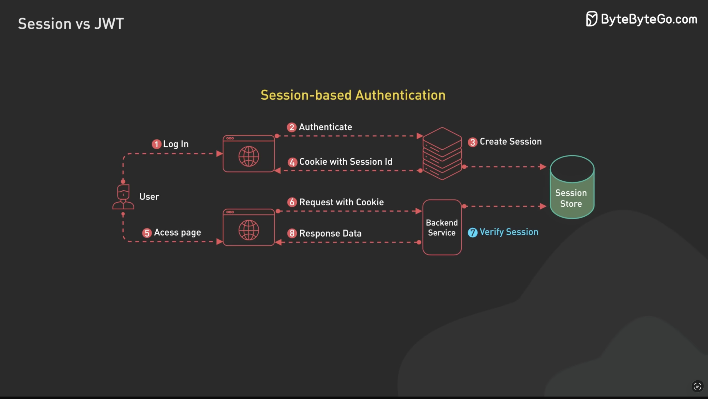

# 3. Session-Based Authentication

### 📖 Definition

**Session-Based Authentication** is an authentication method where the **server stores information about the user's login session**, while the client stores a **session ID** that identifies that session.

The session ID is commonly stored in a **cookie** and automatically sent with subsequent requests.

```text
Client                          Server
  │                               │
  │  POST /login                  │
  │  username + password          │
  ├──────────────────────────────►│
  │                               │
  │                 Create session│
  │                 session_id=abc │
  │                               │
  │  Set-Cookie: session_id=abc   │
  │◄──────────────────────────────┤
  │                               │
  │  GET /profile                 │
  │  Cookie: session_id=abc       │
  ├──────────────────────────────►│
  │                               │
  │                 Find session  │
  │                 session_id=abc│
  │                 → User #123   │
  │                               │
  │  User profile                 │
  │◄──────────────────────────────┤
```

### 🔄 How It Works

1. User sends their **username + password** to the server.
2. Server verifies the credentials.
3. Server creates a **session** and stores information about the authenticated user.
4. Server generates a **session ID**.
5. Server sends the session ID to the client, commonly through a cookie.
6. The client sends the cookie with future requests.
7. Server uses the session ID to find the corresponding session.
8. If the session is valid, the server knows which user is making the request.

### 🗄️ What Is Stored?

The server might store something like:

```text
Session ID: abc123
User ID: 42
Created: ...
Expires: ...
```

The client only needs to keep:

```http
Cookie: session_id=abc123
```

The important distinction is:

> **Session = server-side information about the login.**
> **Session ID = identifier used to find that session.**

### ✅ Pros

* **Simple mental model** — the server knows the logged-in user through the session.
* **Easy session revocation** — deleting the session logs the user out.
* **Sensitive user/session data stays on the server**.
* **Cookies are automatically sent by browsers**.
* Can support **session expiration and inactivity timeouts**.
* Well suited for traditional web applications.

### ❌ Cons

* **Server-side state is required**.
* Sessions need to be stored somewhere, such as memory, a database, or Redis.
* Can become more complicated when running **multiple backend servers** because they need access to the same session storage.
* Requires careful **cookie security configuration**.
* Session storage can add infrastructure and maintenance overhead.

### 🧠 Mental Model

Think of a **coat-check ticket**:

```text
You ──► Server
       "Here's my coat."

Server:
       Stores your coat
       Gives you ticket #123

You ──► Ticket #123

Server:
       "Ticket #123 → that's your coat."
```

The **session ID is the ticket**.

The server holds the actual session information.

### 🍪 Session Auth vs Cookie Auth

These terms are related but **not the same thing**:

* **Session authentication** → describes where the authentication state is stored: **server-side**.
* **Cookie-based authentication** → describes how the client commonly sends the authentication credential: **through a cookie**.

Therefore, you can have:

```text
Session Auth + Cookie
        ↓
Very common
```

But cookies can also contain other things, including tokens such as JWTs.

### 🖼️ Diagram



### 📚 Resources

* [Session-Based Authentication](https://www.youtube.com/watch?v=fyTxwIa-1U0&t=208s)
* [MDN — HTTP Cookies](https://developer.mozilla.org/en-US/docs/Web/HTTP/Guides/Cookies)
* [OWASP — Session Management Cheat Sheet](https://cheatsheetseries.owasp.org/cheatsheets/Session_Management_Cheat_Sheet.html)
* [MDN — HTTP Authentication](https://developer.mozilla.org/en-US/docs/Web/HTTP/Guides/Authentication)

---

[← Basic Auth](./02-basic-auth.md) | [Next: JWT →](./04-jwt.md)
