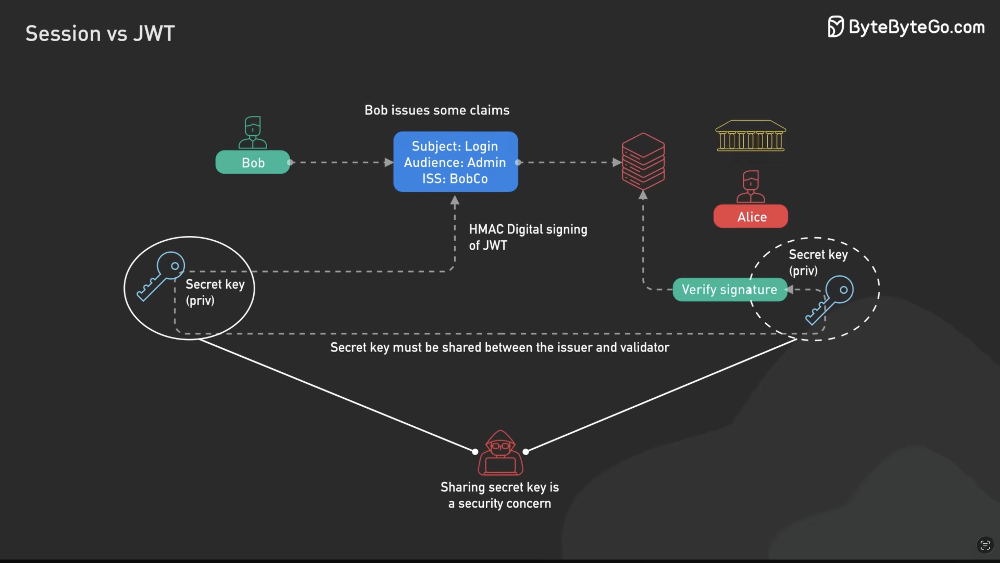

# 4. JSON Web Token (JWT)

### 📖 Definition

**JSON Web Token (JWT)** is a compact, URL-safe token format used to securely transmit information between parties.

A JWT is made of three Base64URL-encoded parts separated by dots:

```text
Header.Payload.Signature
```

For example:

```text
xxxxx.yyyyy.zzzzz
```

* **Header** — contains information about the token, such as the signing algorithm.
* **Payload** — contains claims (information) about the user or token, such as `userId`, `role`, `issuer`, or expiration time.
* **Signature** — allows the server to verify that the token was created by a trusted party and has not been modified.

> ⚠️ **JWTs are not encrypted by default.** The payload can normally be decoded and read. The signature provides integrity and authenticity, not secrecy.

### 🔄 Workflow


### 🖼️ JWT Signing Algorithms


JWTs need to be **signed** so that the receiver can verify that the token has not been modified.

Common signing approaches include:

* **HMAC** — uses the same secret key to sign and verify the JWT.
* **RSA** — uses a private key to sign and a public key to verify.
* **ECDSA** — uses an elliptic-curve private key to sign and a corresponding public key to verify.

The important distinction is:

```text
HMAC
Private/Secret Key ──► Sign
Same Secret Key ──────► Verify

RSA / ECDSA
Private Key ──────────► Sign
Public Key ───────────► Verify
```

---

### 🖼️ HMAC JWT Signing



With **HMAC**, the JWT issuer and the service validating the JWT must both know the **same secret key**.

The issuer uses the secret to create the JWT signature:

```text
JWT + Secret Key
       ↓
     HMAC
       ↓
   Signature
```

When the server receives the JWT, it uses the same secret to verify the signature.

This means the secret key must be securely shared between the systems that create and validate the token.

> 🔑 **HMAC = one shared secret.**
> **RSA/ECDSA = private key signs, public key verifies.**

### 🧠 Mental Model

Think of a JWT as a **signed ID card**:

```text
Payload
"I am User #42"

       +
   
Signature
"Someone trusted signed this"
```

The server doesn't simply trust the information in the payload. It verifies the **signature** first.

### 📚 Resources

* [JWT — jwt.io](https://jwt.io/)
* [RFC 7519 — JSON Web Token](https://www.rfc-editor.org/rfc/rfc7519.html)
* [MDN — Authorization](https://developer.mozilla.org/en-US/docs/Web/HTTP/Reference/Headers/Authorization)

---

[← Session Auth](./03-session-auth.md) | [Back to Authentication →](./README.md)
