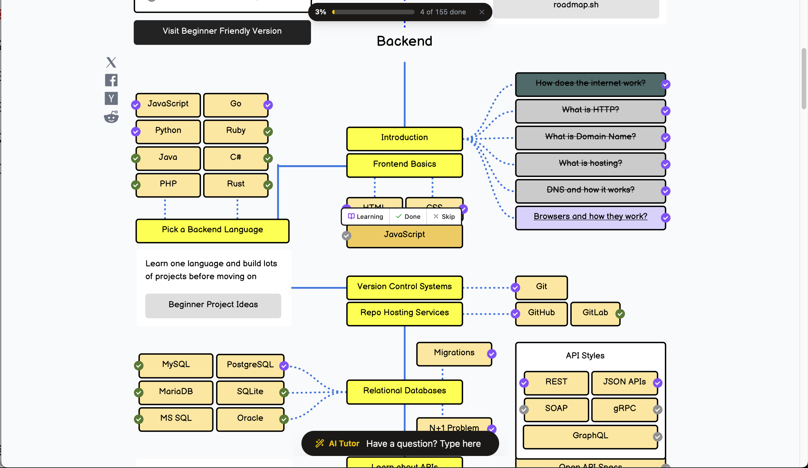

# 🚀 Backend Developer Roadmap

<p align="center">
  <a href="https://roadmap.sh/backend">
    
  </a>
</p>

<p align="center">
  <a href="https://roadmap.sh/backend">
    
  </a>
  
  
</p>

---

## 📖 About

This repository is my personal journey through the **Backend Developer Roadmap**. Each section covers a key concept with curated resources and my own explanation to reinforce my learning.

> 🗺️ Full interactive roadmap available at [roadmap.sh/backend](https://roadmap.sh/backend)

---

## 📚 Table of Contents

- [1. What is HTTP?](#1-what-is-http)
- [2. What is a Domain Name?](#2-what-is-a-domain-name)
- [3. What is Web Hosting?](#3-what-is-web-hosting)
- [4. What is DNS and How it Works?](#4-what-is-dns-and-how-it-works)

---

## 🌐 Backend Fundamentals

### 1. What is HTTP?

#### 📺 Resources

> This one is a bit long but very helpful!

| Resource | Link |
|----------|------|
| 🎬 Full Video | [Watch on YouTube](https://www.youtube.com/watch?v=iYM2zFP3Zn0&t=717s) |
| ⚡ Short Clip | [Watch on YouTube Shorts](https://www.youtube.com/watch?v=jIvqyuZ0fBA) |

#### 💡 My Explanation

**HTTP** stands for **HyperText Transfer Protocol** — a set of rules for communication between a web server and a client, forming the **HTTP request/response cycle**.

- 🔁 **Stateless**: Every request is completely independent of the others.
- 🗃️ To work around statelessness, we use: **Local Storage**, **Cookies**, and **Sessions**.

---

### 2. What is a Domain Name?

#### 📺 Resources

> This video covers everything you need to know about Domain Names.

| Resource | Link |
|----------|------|
| 🎬 Full Video | [Watch on YouTube](https://www.youtube.com/watch?v=qO5qcQgiNX4) |

#### 💡 My Explanation

In simple terms, a **domain name** is the address of your website — what users type into the browser to access it.

- 🤖 Your computer understands: `172.217.160.142` *(IP Address)*
- 🧑 Humans understand: `google.com` *(Domain Name)*

> [!NOTE]
> You need to understand **DNS** to fully understand how Domain Names work. See section 4 below.

---

### 3. What is Web Hosting?

#### 📺 Resources

| Resource | Link |
|----------|------|
| 🎬 Full Video | [Watch on YouTube](https://www.youtube.com/watch?v=AXVZYzw8geg) |

#### 💡 My Explanation

Even with a domain name, no one can access your website unless it is **hosted**.

**Web Hosting** is a service that stores your website files on a server and makes them accessible on the internet.

| Hosting Type | Description | Best For |
|--------------|-------------|----------|
| 🤝 Shared Hosting | You share a server with others | Beginners / Cheapest option |
| 🖥️ VPS Hosting | Your own virtual private server | Small businesses |
| 💪 Dedicated Hosting | Your own physical server | High-traffic websites |
| ☁️ Cloud Hosting | Uses a cloud computing platform | Large businesses / Scalability |

---

### 4. What is DNS and How it Works?

#### 📺 Resources

> A very good video to understand DNS and how it works!

| Resource | Link |
|----------|------|
| 🎬 Full Video | [Watch on YouTube](https://www.youtube.com/watch?v=Wj0od2ag5sk) |

#### 💡 My Explanation

**DNS** (Domain Name System) is like a **phonebook for the internet** — it translates human-readable domain names into IP addresses that computers can understand.

```
User types:  google.com
     ↓
DNS Lookup:  google.com → 142.250.80.46
     ↓
Browser connects to the IP address
```

---

<p align="center">
  <i>📌 This roadmap is a living document — more topics will be added as I progress!</i>
</p>
